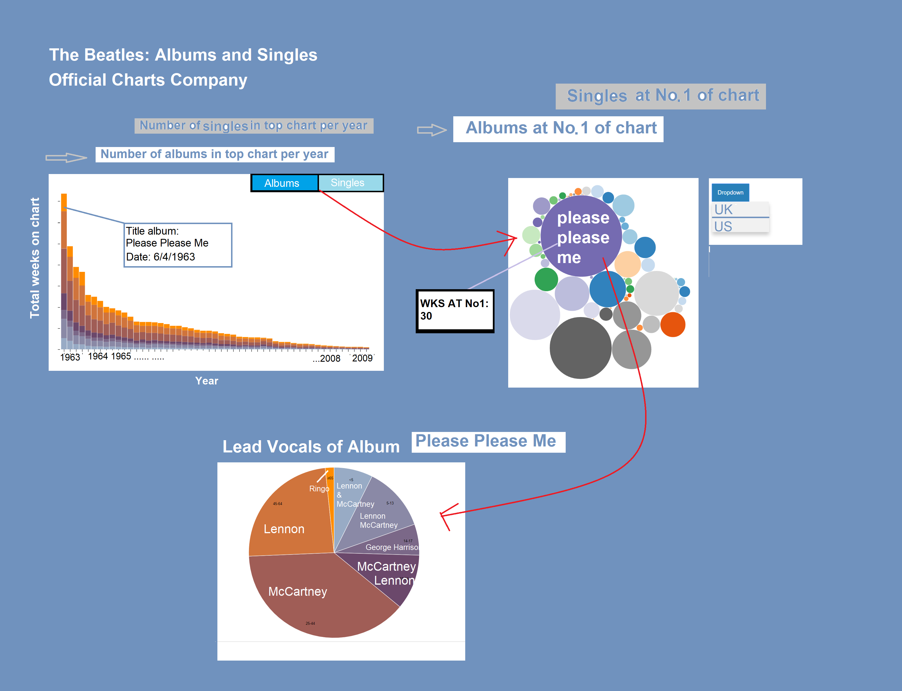

# Programming project - Project Proposal #

Mercylyn Wiemer (10749306)

[The Beatles Albums and Charts](https://mercylyn.github.io/mprogproject/index.html)

## The Beatles chart position analysis ##

The Beatles were an English rockband from Liverpool England 1960. The band is considered as the most influential music band in history. The visualisations will present the number of albums and singles from the year 1963 to 2009 that reached the Official Charts Company. The Albums/Singles that reached No. 1 are visualised separately. Furthermore, there is the possibility to see the percentage of Lead Vocals per band member of a selected album.

Three visualisations:
1) Number of albums / singles that reached the Charts (stacked bar chart) UK
2) Albums / Singles at No. 1 (bubble chart) UK or US
3) Lead vocals per album (pie chart)

Bron: https://nl.wikipedia.org/wiki/The_Beatles

## Problem statement ##
The Beatles wrote more than 300 songs. Which albums and singles reached the top chart in the UK and on the other side of the Atlantic US?

## Solution ##
Visualizing the albums and singles that reached the Charts!

### main features ###
* Number of albums and singles in top chart per year (options: albums - singles)
* Albums and singles that reached no. 1 in the UK or US
* Lead Vocals in percentage per band member by selecting an album that reached no. 1 in the UK or US
## Prerequisities ##

### data sources ###
* https://www.theguardian.com/news/datablog/2009/sep/09/beatles-albums-singles-music-rock-band
* https://docs.google.com/spreadsheets/d/1VI7e2yYOWcHnAG-0DaFJfbts-iT6QHU5pOq-Ajd62HE/edit
* https://en.wikipedia.org/wiki/Please_Please_Me
* https://nl.wikipedia.org/wiki/The_Beatles

### external components ###
* d3-tip

### similar visualizations ###
* https://public.tableau.com/en-us/s/gallery/beatles-analysis
* http://research.google.com/bigpicture/music/
* https://artist-explorer.glitch.me/

### hardest parts ###
* linking the visualisations
* separately going through every album that reached no. 1 in the UK/US for the lead vocals
