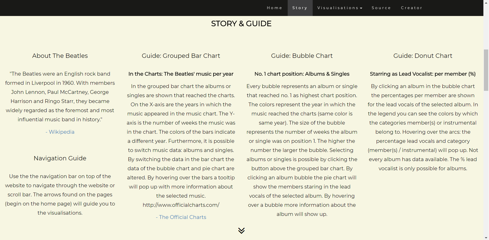
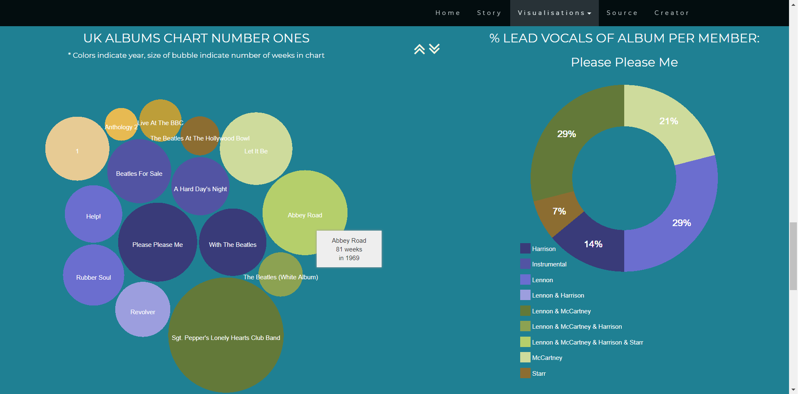
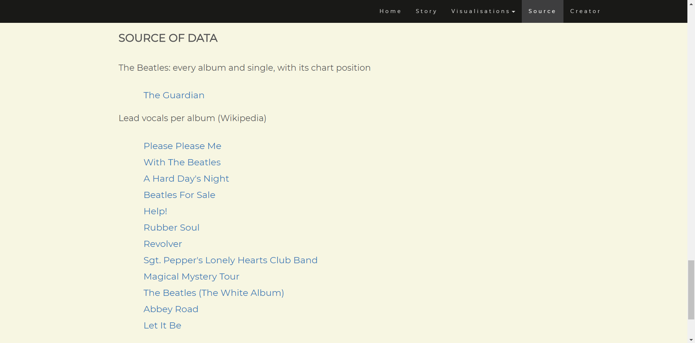
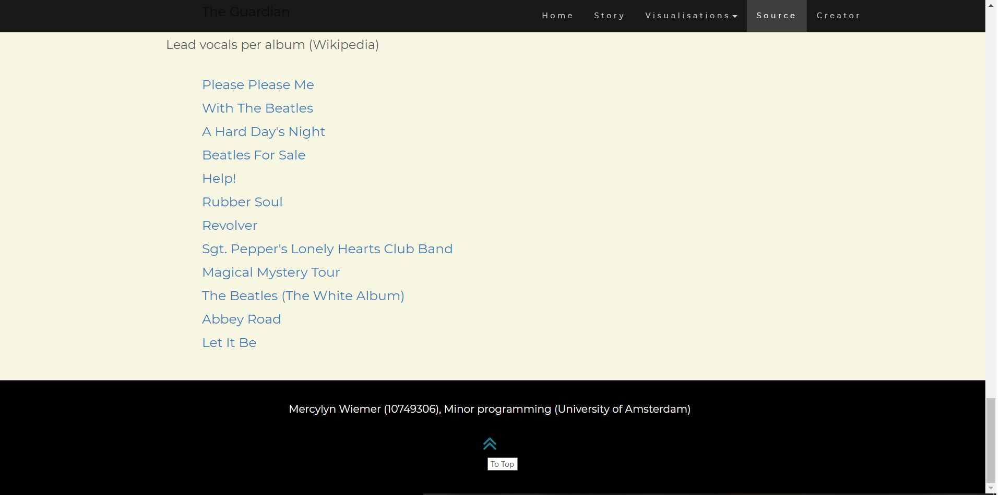

# Programming project #

Mercylyn Wiemer (10749306)
Minor Programming, University of Amsterdam

[The Beatles chart position analysis](https://mercylyn.github.io/mprogproject/index.html)

# The Beatles chart position analysis #

The Beatles were an English rockband from Liverpool, England. The band is considered as the most influential music band in history. The visualisations will present the number of albums and singles from the year 1963 to 2009 that reached the Official Charts Company. The albums and singles that reached No. 1 are visualised separately. Furthermore, there is the possibility to see the percentage of Lead Vocals per band member of selected albums (chart position no. 1).

Three visualisations:
1) Grouped bar chart: albums or singles that reached the Charts (The Official Charts Company) with number of weeks in chart
2) Bubble chart: albums or singles with highest position no. 1
3) Donut chart: members of the band starring as lead vocals position no. 1 albums only

Source: https://nl.wikipedia.org/wiki/The_Beatles

## Main Purpose ##
The Beatles wrote more than 300 songs. The goal of this project is to give an overview
of albums and singles that reached the top chart in the UK (Official Charts Company).

### Main features ###
* Number of albums and singles in top chart per year (options: albums - singles)
* Albums and singles that reached no. 1 in the UK
* Lead Vocals in percentage per band member by selecting an album that reached no. 1 in the UK

### Data sources ###
* https://www.theguardian.com/news/datablog/2009/sep/09/beatles-albums-singles-music-rock-band
* https://en.wikipedia.org/wiki/Please_Please_Me
* https://en.wikipedia.org/wiki/With_the_Beatles
* https://en.wikipedia.org/wiki/A_Hard_Day%27s_Night_(album)
* https://en.wikipedia.org/wiki/Beatles_for_Sale
* https://en.wikipedia.org/wiki/Help!_(album)
* https://en.wikipedia.org/wiki/Rubber_Soul
* https://en.wikipedia.org/wiki/Revolver_(Beatles_album)
* https://en.wikipedia.org/wiki/Sgt._Pepper%27s_Lonely_Hearts_Club_Band
* https://en.wikipedia.org/wiki/Magical_Mystery_Tour
* https://en.wikipedia.org/wiki/The_Beatles_(album)
* https://en.wikipedia.org/wiki/Abbey_Road
* https://en.wikipedia.org/wiki/Let_It_Be

### External code sources ###
Grouped bar chart
* https://stackoverflow.com/questions/37812922/grouped-category-bar-chart-with-different-groups-in-d3
* https://plnkr.co/edit/L0eQwtEMQ413CpoS5nvo?p=preview

Bubble chart
* https://bl.ocks.org/alokkshukla/3d6be4be0ef9f6977ec6718b2916d168
* https://bl.ocks.org/mbostock/4063269

Donut chart
* http://bl.ocks.org/arpitnarechania/577bd1d188d66dd7dffb69340dc2d9c9
* https://bl.ocks.org/rshaker/225c6df494811f46f6ea53eba63da817

Tooltip
* http://bl.ocks.org/Caged/6476579
* http://bl.ocks.org/d3noob/a22c42db65eb00d4e369

Html themes
* https://www.w3schools.com/bootstrap/bootstrap_theme_band.asp
* https://www.w3schools.com/bootstrap/bootstrap_theme_company.asp

### External images sources ###
The Beatles logo
* https://freebiesupply.com/logos/the-beatles-logo/

The Beatles drawings
* https://wallhere.com/en/wallpaper/1360761

## Author ##
* Mercylyn Wiemer

## Acknowledgements ##
University of Amsterdam - Minor Progamming
