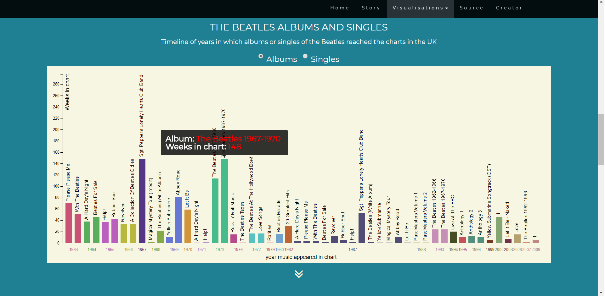

# The Beatles charts analysis - Report #

Mercylyn Wiemer (10749306)
Minor Programming, University of Amsterdam

The Beatles were a English rockband from Liverpool, England. In the current
project their music: albums and singles are analysed. Which music reached the
Official Charts Company. The albums and singles that reached No. 1 in the charts
are visualised separately. Furthermore, there is the possibility to see the
percentage of starring lead Vocalists per album of albums that reached chart position no. 1.

# Technical design #

## data sources ##
Some of the lead vocals data was not available directly from the Wikipedia page, e.g.
"The Beatles at the Hollywood Bowl". So, I solved this by alerting the user that no data was available.

## technical components ##
### navigation bar ###
Use the navigation bar on top of the website to navigate through the website
or scroll bar. The arrows found on the pages (begin on the home page) will guide
you to the visualisations.

* An JS scrollspy is used to automatically update the navbar links when scrolling.
* Addiontal nagivation via awesome font icons: guide from home to visualizations and vice versa.

### grouped bar chart ###
In the grouped bar chart the albums or singles are shown that reached the charts.
On the X-axis are the years in which the music appeared in the music chart. The
Y-axis is the number of weeks the music was in the chart. The colors of the bars
indicate a different year. Furthermore, it is possible to switch music data:
albums and singles. By switching the data in the bar chart the data of the
bubble chart and pie chart are altered. By hovering over the bars a tooltip
will pop up with more information about the selected music.

* data from The Guardian: albums/singles chart position and weeks in chart
* colors: improve for the colorblind http://tools.medialab.sciences-po.fr/iwanthue/
* tooltips: D3 tooltip
* create and update grouped bar chart with makeBarChart() and the updateBar() function
* used d3 for adding radio button for switching data from albums to singles and vice versa
* anonymous function for the radio button change: update bar chart and bubble chart         including title of bubble chart and instruction text for donut chart. If singles dataset
is selected: changed instruction donut chart with warning that bubble chart is not available for selecting music.

### bubble chart ###
Every bubble represents an album or single that reached no. 1 as highest chart position.
The colors represent the year in which the music reached the charts (same color is same year).
The size of the bubble represents the number of weeks the album or single was on position 1.
The higher the number the larger the bubble. Selecting albums or singles is possible by clicking the button
above the grouped bar chart. By clicking an album bubble the pie chart will show
the members staring in the lead vocals of the selected album. By hovering over
a bubble more information about the album will show up.

### pie chart ###
By clicking an album in the bubble chart the percentages per member are shown for
the lead vocals of the selected album. In the legend you can see the colors by
which the categories member(s) or instrumental belong to. Hovering over the arcs:
the percentage lead vocals and category (member(s) / instrumental) will pop up.
Not every album has data available. The % lead vocalist is only possible for albums.

# challenges #
* stacked bar chart to grouped bar chart
* positioning elements on website: grid system
* positioning the visualisations to clearly observe the data
* updating charts especially the pie chart

- defend decisions
