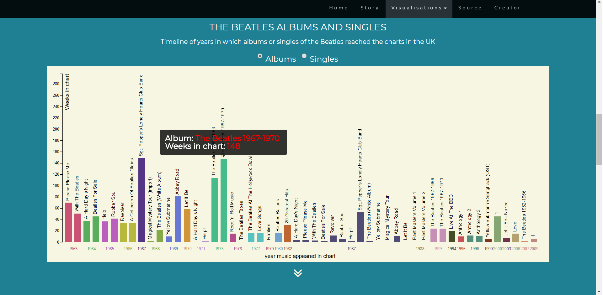

# The Beatles chart analysis - Report #

Mercylyn Wiemer (10749306)
Minor Programming, University of Amsterdam

The Beatles were a English rockband from Liverpool, England. In the current
project their music: albums and singles are analysed. Which music reached the
Official Charts Company. The albums and singles that reached No. 1 on the chart
are visualised separately. Furthermore, there is the possibility to see the
percentage of starring lead vocalists of the albums that reached chart position no. 1.

Main visualisation: Albums that were on the chart with year on the x-axis and the number of weeks on the chart on the y-axis.

# Technical design #

## Data sources ##
Some of the lead vocals data was not available directly from the Wikipedia page, e.g.
"The Beatles at the Hollywood Bowl". So, I solved this by alerting the user that no data was available.

## Technical components ##
### Navigation bar ###
Use the navigation bar on top of the website or the scroll bar to navigate through the website. The arrows found on the pages (begin at the home page) will guide you to the visualizations

* An JS scrollspy is used to automatically update the navbar links when scrolling.
* Addiontal navigation via awesome font icons: guide from home to visualizations and vice versa.

### Grouped bar chart ###
In the grouped bar chart the albums or singles are shown that reached the chart.
On the X-axis are the years in which the music appeared on the chart. The
Y-axis is the number of weeks the music was on the chart. The colors of the bars
indicate a different year. Furthermore, it is possible to switch music data:
albums and singles. By switching the data in the bar chart, the data of the
bubble chart and the donut chart are updated. By hovering over the bars a tooltip
will pop up with more information about the selected music.

* Data from The Guardian: albums/singles chart position and weeks in chart.
* Colors: improve for the colorblind http://tools.medialab.sciences-po.fr/iwanthue/
* Tooltip: D3 tooltip to hover over the bars and get more information.
* Create and update grouped bar chart with makeBarChart() and the updateBar() function.
* Used d3 for adding radio button for switching data from albums to singles and vice versa.
* Anonymous function for the radio button change: update bar chart and bubble chart including title of bubble chart and instruction text for donut chart. If singles dataset is selected: change the instruction of the donut chart with a warning that the bubble chart is not available for selecting music with singles.

### Bubble chart ###
Every bubble represents an album or single that reached no. 1 as highest chart position.
The colors represent the year in which the music reached the charts, so the same color means the same year of
chart appearance. The size of the bubble represents the number of weeks the album or single was on position 1.
The higher the number the larger the bubble. Selecting albums or singles can be done by clicking the button
above the grouped bar chart. By clicking an album bubble the donut chart will show
the members staring in the lead vocals of the selected album. By hovering over
a bubble more information about the album will show up.

* Data from The Guardian: albums/singles chart position no 1. and weeks no. 1 in chart.
* Basic tooltip to hover over the bubbles and get more information.
* Use global variable updateBubble to use update function in other function e.g.
    radio button in the grouped bar chart.

### donut chart ###
By clicking an album in the bubble chart the percentages per member are shown for
the lead vocals of the selected album. In the legend you can see the colors by
which the categories member(s) or instrumental belong to. Hovering over the slices:
the percentage lead vocals and category (member(s) / instrumental) will pop up.
Not every album has data available. The % lead vocalist is only possible for albums.

* Data from Wikipedia: lead vocals on the album per bandmember.
* I chose to categorize the members as following, individual (McCartney, Lennon,
    Harrison, Starr) or together (Lennon & McCartney, Lennon & Harrison, Lennon
    & McCartney & Harrison, Lennon & McCartney & Harrison & Starr) or instrumental.
    This means that there is no hierarchical meaning in this categories. The
    members are only starring as lead vocalist in these songs. However, The
    data of Wikipedia implies a hierarchical order. For example, different
    categories exist as: Lennon with McCartney or McCartney with Lennon. I did
    not use these categories to keep it as simple as possible.
* Basic tooltip to hover over the slices and get more information.
* Added legend for the different members and instrumental, however when no data
    is available another legend rectangle would be made and added to the legend.
    I choose to delete this rectangle, because it did not have any value due to
    disappearance of the donut chart when no data is available.
* Use global variable updateDonut to use update function in other function e.g.
    radio button in the grouped bar chart and bubbles in the bubble chart.

# Challenges #
## From stacked bar chart to grouped bar chart ##

Converting the data to use for the stacked bar chart was a big challenge.
Eventually, I decided to use a grouped bar chart, because it was easier to
convert the data for this visualization and it would give a clear overview of
the different years in which the music of The Beatles appeared on the chart.
It would have been educational to make a stacked bar chart, but I also had to
made the decision to switch to be on schedule. Otherwise, I think the stacked bar
chart would have been more compact and thus better accessible.

## Positioning elements on the website including the visualisations: grid system ##
I choose to put the grouped bar chart as main chart and give it many space.
Otherwise, the albums or singles wouldn't be clearly visible. Underneath the
grouped bar chart I positioned the donut chart and the bubble chart sharing the
row. These charts are smaller and therefor better next to each other. Using the
Bootstrap grid system helped positioning the different elements on the web page.

## Updating charts especially the donut chart ##
For the donut chart it was needed to calculate that arc of the slices. This was
new for me and took some time to understand. However, looking at examples helped
me to update the donut chart correctly. Also, going through the
example code with a TA made it more clear.

## Getting data for the lead vocals ##
For a good amount of albums the lead vocals were accessible on Wikipedia. However,
for few of the albums a different layout was used where the lead vocals weren't
mentioned or the data was incomplete. For example, anthology 2 with 45 songs. I choose
to not individually go through all the songs for collecting the lead vocals, because
this would have been time consuming and I wanted to have enough time for creating the
visualisations. Because of previous experience with looking for data to long I
wanted to beat the clock for this project. As a solution I informed the web user
that for the selected album unfortunately no data was available.
